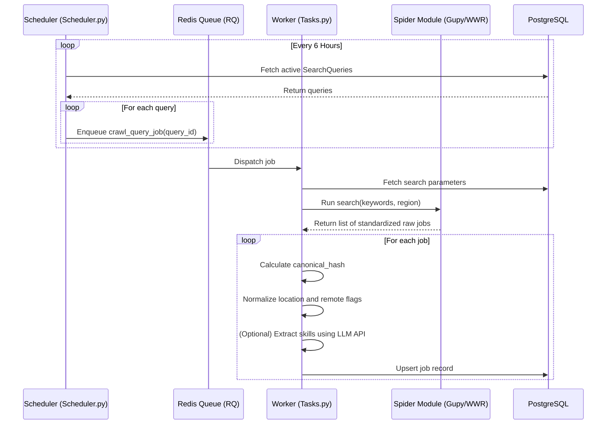

# Document Control
*   **Document Title:** Implementation Plan - Query-Driven Job Crawler
*   **Version:** 1.0.0
*   **Status:** Approved
*   **Date:** 2026-06-29
*   **Author:** Bettina Acosta de Paula
*   **Description:** Technical step-by-step implementation plan for the database schema, worker logic, scraping pipelines, and web endpoints.

## Revision History
| Version | Date | Author | Description of Change |
|---------|------|--------|-----------------------|
| 1.0.0   | 2026-06-29 | Bettina Acosta de Paula | Initial publication of the technical implementation guide. |

---

# Implementation Plan - Query-Driven Job Crawler

This document details the step-by-step architectural design, folder structure, database schemas, and integration flows to build the **Query-Driven Job Crawler**.

---

## 1. Directory Structure

We will structure the project using a modular, decoupled Python architecture suitable for running in Docker environments:

```
job-crawler/
│
├── api/                   # FastAPI REST Application
│   ├── __init__.py
│   ├── main.py            # API routing, startup/shutdown lifecycles
│   └── dependencies.py    # DB sessions, queue configurations
│
├── core/                  # Core Business Logic & Models
│   ├── __init__.py
│   ├── config.py          # Environment variable loading (Pydantic Settings)
│   ├── database.py        # SQLAlchemy engine and session pool setup
│   ├── models.py          # SQLAlchemy SQL models
│   ├── normalizer.py      # Location parsing and data normalization logic
│   └── deduper.py         # Hash-based deduplication engine
│
├── workers/               # Redis Queue (RQ) Tasks
│   ├── __init__.py
│   ├── tasks.py           # Background scraping and database writing tasks
│   └── scheduler.py       # Cron schedule definitions
│
├── spiders/               # Scraper Classes
│   ├── __init__.py
│   ├── base_spider.py     # BaseSpider interface definition
│   ├── wworkremotely.py   # Scraper for WeWorkRemotely API
│   ├── gupy.py            # Scraper for Gupy search endpoints
│   └── google_jobs.py     # Scraper for Google Jobs search listings
│
├── migrations/            # Database schema migrations (Alembic)
│
├── docker-compose.yml     # Orchestration for FastAPI, Redis, Postgres
├── Dockerfile             # Multi-stage Docker configuration
├── requirements.txt       # Project python dependencies
└── README.md
```

---

## 2. Database Schema (PostgreSQL SQLAlchemy Models)

The schemas will be defined in `core/models.py` using SQLAlchemy:

### `SearchQuery` Model
Represents the user's saved search configurations.
```python
class SearchQuery(Base):
    __tablename__ = "search_queries"

    id = Column(UUID(as_uuid=True), primary_key=True, default=uuid.uuid4)
    keywords = Column(String, nullable=False)           # e.g., "Data Product Manager"
    region = Column(String, nullable=False)             # e.g., "Brazil", "LATAM", "USA/Canada"
    is_remote_only = Column(Boolean, default=True)      # e.g., Filter for remote roles
    is_active = Column(Boolean, default=True)           # Should the scheduler run this query?
    created_at = Column(DateTime, default=datetime.utcnow)
```

### `JobListing` Model
Represents crawled job postings.
```python
class JobListing(Base):
    __tablename__ = "job_listings"

    id = Column(UUID(as_uuid=True), primary_key=True, default=uuid.uuid4)
    search_query_id = Column(UUID(as_uuid=True), ForeignKey("search_queries.id"), nullable=False)
    title = Column(String, nullable=False)              # e.g., "Senior Product Manager"
    company = Column(String, nullable=False)            # e.g., "TechCorp"
    location_raw = Column(String, nullable=False)       # Raw string from target board
    country = Column(String, nullable=True)             # Normalized country (e.g. "Brazil")
    city = Column(String, nullable=True)                # Normalized city
    is_remote = Column(Boolean, default=True)           # Parsed remote status
    description = Column(Text, nullable=False)          # Full job description text
    salary_raw = Column(String, nullable=True)          # Raw salary info (if listed)
    source = Column(String, nullable=False)             # Source board (e.g., "Gupy")
    source_url = Column(String, nullable=False)         # Application link
    canonical_hash = Column(String, unique=True, nullable=False) # SHA256 dedupe key
    skills_extracted = Column(JSONB, default=list)      # JSON list of extracted skill tags
    date_posted = Column(Date, nullable=True)           # Date published
    created_at = Column(DateTime, default=datetime.utcnow)
```

---

## 3. Scraper Pipeline & Spider Architecture

Every spider must inherit from `BaseSpider` in `spiders/base_spider.py`:

```python
class BaseSpider:
    def __init__(self):
        self.name = "base"

    def search(self, keywords: str, region: str) -> list[dict]:
        """
        Sends queries to target site endpoints.
        Returns a list of standardized job dictionaries containing:
        {title, company, location_raw, description, salary_raw, source_url}
        """
        raise NotImplementedError
```

### Deduplication Logic (`core/deduper.py`)
To prevent duplicate job entries:
1.  Standardize strings: convert `title` and `company` to lowercase, stripping special characters.
2.  Compute SHA-256 hash: `sha256(normalized_title + normalized_company + remote_status)`.
3.  Store this hash in `canonical_hash` using a unique database index.
4.  On conflict, update `date_posted` and `source_url` (upsert behavior) without duplicating the record.

---

## 4. Background Workers & Job Ingestion Flow

The scheduling and processing flow will run on Redis Queue (RQ) workers:



---

## 5. Verification Plan

### Automated Test Suite
We will write tests in `/tests` using `pytest` and `httpx` to verify network isolation:
1.  **Spider Unit Tests:** Mock HTTP requests for Gupy and WeWorkRemotely, validating that scraper parses fields correctly.
2.  **Deduplication Tests:** Verify that inserting a duplicate job listing raises a database constraint or is handled cleanly via SQLAlchemy upserts.
3.  **API Integration Tests:** Run standard test clients to POST search configurations and GET job aggregations.

### Manual Verification
1.  Run the system locally: `docker-compose up --build`.
2.  Navigate to `http://localhost:8000/docs` (Swagger UI).
3.  Register a new query (e.g., `Keywords="Data Product Manager"`, `Region="Brazil"`).
4.  Examine logs for the RQ worker initiating the Gupy/WWR spiders.
5.  Check the database or call `GET /jobs` to verify normalized entries are persisted.
